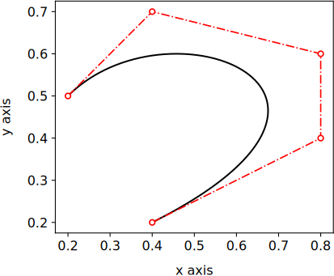
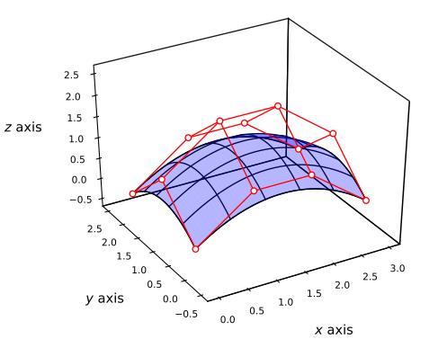

# nurbspy


## Description
`nurbspy` is a Python package to create and work with Non-Uniform Rational Basis Spline (NURBS) curves and surfaces.
The classes and methods were inspired by the algorithms presented in [The NURBS Book](https://doi.org/10.1007/978-3-642-59223-2) and the code was implemented using vectorized [Numpy](https://numpy.org/) functions and [Numba's](http://numba.pydata.org/) just-in-time compilation decorators to achieve C-like speed.
 
`nurbspy` aims to be a simple NURBS library, not a fully fledged CAD kernel. If you need a powerful, open source CAD kernel we recommend you to check out the C++ [OpenCascade](https://www.opencascade.com/doc/occt-7.4.0/overview/html/index.html) library. If you feel that OpenCascade is too complex or you are not sure how to start using it, [this repository](https://github.com/RoberAgro/primer_open_cascade) might be useful for you!


<p style="margin-top:1cm;"> </p>
<p align="center">
        
<p style="margin-bottom:0cm;"> </p>
 
<p style="margin-top:0cm;"> </p>
<p align="center">
	
	&emsp; &emsp; &emsp;
	
</p>
<p style="margin-bottom:1cm;"> </p>


## Capabilities

`nurbspy` has the following features to create and use NURBS curves:

- Constructors for rational and non-rational Bézier and B-Spline curves
- Methods to evaluate curve coordinates
- Methods to evaluate arbitrary-order derivatives analytically
- Methods to evaluate the tangent, normal, and binormal unitary vectors (Frenet-Serret frame of reference)
- Methods to compute the curvature and torsion
- Methods to compute the arc-length of the curve by numerical quadrature
- Methods to visualize the curve using the Matplotlib library


In addition, `nurbspy` provides the following capabilities to create and use NURBS surfaces:


- Constructors for rational and non-rational Bézier and B-Spline surfaces
- Additional constructors for some common special surfaces:
	- Bilinear surfaces
	- Ruled surfaces
	- Extruded surfaces
	- Revolution surfaces
	- Coons surfaces
- Methods to evaluate surface coordinates
- Methods to evaluate arbitrary-order derivatives analytically
- Methods to evaluate the unitary normal vector
- Methods to evaluate the mean and Gaussian curvatures
- Methods to compute u- and v-isoparametic curves
- Methods to visualize the surface using the Matplotlib library

In addition,  `nurbspy` can work with real and complex data types natively. This allows to compute accurate (down to [machine epsilon!](https://en.wikipedia.org/wiki/Machine_epsilon)) shape derivatives using the [complex step method](https://blogs.mathworks.com/cleve/2013/10/14/complex-step-differentiation/) and avoid the numerical error incurred by finite-difference derivative approximations. This shape sensitivity information is necessary to solve shape optimization problems with many design variables using gradient based-optimization algorithms. To our knowledge, `nurbspy` is the only Python package that provides the flexibility to work with complex numbers right away.


## Installation

`nurbspy` has the following mandatory runtime dependencies:

 - `numpy` (multidimensional array library)
 - `scipy` (scientific computing library)
 - `numba` (just-in-time Python compiler)
 - `matplotlib` (visualization library)
 
In addition `nurbspy` uses `pytest` for local tests.


`nurbspy` is available on Linux via the [pip](https://pip.pypa.io/en/stable/) package manager. The installation with pip is straightfoward:

	pip install nurbspy
	not yet available :(


`nurbspy` is also available on Linux via the [conda](https://pip.pypa.io/en/stable/) package manager thanks to the infrastructure provided by [conda-forge](https://conda-forge.org/). In order to install `nurbspy` via conda you need to add `conda-forge` to your channels and then use the install command

	conda config --add channels conda-forge
	conda install nurbspy
	not yet available :(


You can verify that `nurbspy` was successfully installed by running the examples provided below.


## Minimum working examples

### NURBS curves

`nurbspy` can  be used to create Bézier, B-Spline and NURBS curves. The type of curve depends on the arguments used to initialize the curve class. As an example, the following code snippet can be used to generate a degree four Bézier curve in two dimensions

```py
# Import packages
import numpy as np
import nurbspy as nrb
import matplotlib.pyplot as plt

# Define the array of control points
P = np.zeros((2,5))
P[:, 0] = [0.20, 0.50]
P[:, 1] = [0.40, 0.70]
P[:, 2] = [0.80, 0.60]
P[:, 3] = [0.80, 0.40]
P[:, 4] = [0.40, 0.20]

# Create and plot the Bezier curve
bezierCurve = nrb.NurbsCurve(control_points=P)
bezierCurve.plot()
plt.show()
```

If the installation was succesful, you should be able to see the Bézier curve when you execute the previous code snippet.

<p style="margin-bottom:0.5cm;"> </p>
<p align="center">
        
</p>
<p style="margin-bottom:0.5cm;"> </p>


Check out the [curve demos](./demos/demos_curves) directory to see more examples showing the capabilities of the library and how to use them.


### NURBS surfaces

Similarly, `nurbspy` can  be used to create Bézier, B-Spline and NURBS surfaces. The type of surface depends on the arguments used to initialize the curve class. As an example, the following code snippet can be used to generate a simple Bézier surface of degree 3 in the u-direction and degree 2 in the v-direction:

```py
# Import packages
import numpy as np
import nurbspy as nrb
import matplotlib.pyplot as plt

# Define the array of control points
n_dim, n, m = 3, 4, 3
P = np.zeros((n_dim, n, m))

# First row
P[:, 0, 0] = [0.00, 0.00, 0.00]
P[:, 1, 0] = [1.00, 0.00, 1.00]
P[:, 2, 0] = [2.00, 0.00, 1.00]
P[:, 3, 0] = [3.00, 0.00, 0.00]

# Second row
P[:, 0, 1] = [0.00, 1.00, 1.00]
P[:, 1, 1] = [1.00, 1.00, 2.00]
P[:, 2, 1] = [2.00, 1.00, 2.00]
P[:, 3, 1] = [3.00, 1.00, 1.00]

# Third row
P[:, 0, 2] = [0.00, 2.00, 0.00]
P[:, 1, 2] = [1.00, 2.00, 1.00]
P[:, 2, 2] = [2.00, 2.00, 1.00]
P[:, 3, 2] = [3.00, 2.00, 0.00]

# Create and plot the Bezier surface
bezierSurface = nrb.NurbsSurface(control_points=P)
bezierSurface.plot(control_points=True, isocurves_u=6, isocurves_v=6)
plt.show()
```

If the installation was succesful, you should be able to see the Bézier surface when you execute the previous code snippet.

<p style="margin-top:0.0cm;"> </p>
<p align="center">
        
<p style="margin-bottom:0.0cm;"> </p>


Check out the [surface demos](./demos/demos_surfaces) directory to see more examples showing the capabilities of the library and how to use them.


## Contact information

`nurbspy` was developed by [Roberto Agromayor](https://www.ntnu.edu/employees/roberto.agromayor) under the supervision of Associate Professor [Lars O. Nord](https://www.ntnu.edu/employees/lars.nord) at the [Norwegian University of Science and Technology (NTNU)](https://www.ntnu.no/) as part of his PhD on turbomachinery shape optimization. Please, drop us an email to [roberto.agromayor@ntnu.no](mailto:roberto.agromayor@ntnu.no) if you have questions about the code or you have a bug to report!
